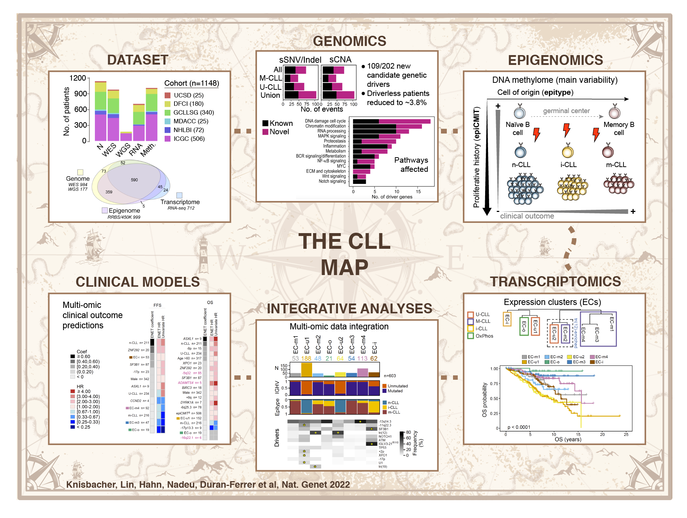

# Molecular map of chronic lymphocytic leukemia and its impact on outcome

## Abstract
Recent advances in the characterization of cancers have consistently revealed marked heterogeneity, impeding the completion of integrated molecular and clinical maps for each malignancy. Here, we focus on chronic lymphocytic leukemia (CLL), a B cell neoplasm with variable natural history which is conventionally categorized into two subtypes distinguished by the extent of somatic mutations in the heavy chain variable region of immunoglobulin genes (IGHV). To build the ‘CLL map,’ we integrated genomic, transcriptomic, and epigenomic data from 1149 patients. We identified 202 candidate genetic drivers of CLL (109 novel) and refined the characterization of its IGHV subtypes, which revealed distinct genomic landscapes with unique patterns of leukemogenic trajectories. Discovery of new gene expression subtypes further subcategorized this neoplasm and proved to be an independent prognostic factor. Clinical outcomes were associated with a combination of genetic alterations, epigenetic states, and gene expression clusters, further advancing our prognostic paradigm. Overall, this work reveals fresh insights into CLL oncogenesis and prognostication. Here, I provide the code to calculate epitype and the epiCMIT mitotic clock for all the data in the study.  

## Graphical summary

## Code availability

The parent repository for the whole study can be found [here](https://github.com/getzlab/CLLmap). The code for estimating CLL epitypes and epiCMIT is subsequently presented:

### CLL epitype calculation for RRBS

Chronic lymphocytic leukemia (CLL) is the most frequent leukemia in the western countries and presents with a broad spectrum of clinical behaviors. This can be partially captured by the presence of two biological subtypes distinguished by the extent of somatic mutations in the heavy chain variable region of immunoglobulin genes (IGHV). These groups are unmutated (U) and mutated (M) CLL, with poorer and better clinical outcome, respectively. Nonetheless, [Kulis et al., 2012](https://www.nature.com/articles/ng.2443) found that CLL can be actually classified in 3 groups or epitypes based on different DNA methylation imprints of pre- and post- germinal center experienced B cells. These epitypes, which add further clinical information beyond IGHV subgroups, were named n-CLL (formed mainly by U-CLL), m-CLL (formed mainly by M-CLL) and i-CLL ( formed by U-CLL and M-CLL). Here, I present all necessary steps to find the CLL epitypes in RRBS data.

[Complete tutorial for CLL epitype prediction using your NGS DNA methyaltion data.](https://duran-ferrerm.github.io/CLLmap-epigenetics/Epitype.RRBS.html)

### epiCMIT mitotic clock calculation. 

The CLL epitypes can be further delineated by their proliferative histories measured by the [epiCMIT](https://www.nature.com/articles/s43018-020-00131-2) mitotic clock using DNA methylation data. This epiCMIT score represents a strong and continuous variable predicting outcome in the context of CLL epitypes.

[Complete tutorial for estimating epiCMIT in your CLL samples.](https://duran-ferrerm.github.io/CLLmap-epigenetics/epiCMIT.RRBS.html)

## LICENSE
LICENSE terms for epitype predictions and epiCMIT can be found [here](https://github.com/Duran-FerrerM/Pan-B-cell-methylome/blob/master/LICENSE)

## Citation
If you use any data or code derived from this study, please cite: *Knisbacher, Lin, Hahn, Nadeu, Duran-Ferrer et al. Molecular map of chronic lymphocytic leukemia and its impact on outcome, Nat. Genet, 2022, accepted*.

## Contact
If you have any question, comment or suggestions please contact me at: *maduran@clinic.cat* :-)

