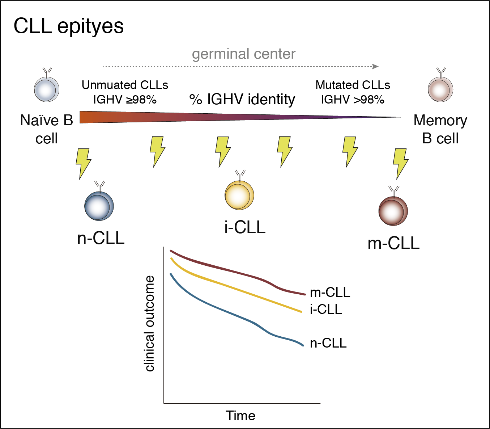

```{r setup, include=FALSE}
knitr::opts_chunk$set(echo = TRUE)
```

# Introduction
Chronic lymphocytic leukemia (CLL) is the most frequent leukemia in the western countries and presents with a broad spectrum of clinical behaviors. This can be partially captured by the presence of two biological subtypes distinguished by the extent of somatic mutations in the heavy chain variable region of immunoglobulin genes (IGHV). These groups are unmutated (U) and mutated (M) CLL, with poorer and better clinical outcome, respectively. Nonethless, [Kulis et al., 2012](https://www.nature.com/articles/ng.2443) found that CLL can be actually classified in 3 groups or epitypes based on different DNA methylation imprints of pre- and post- germinal center experienced B cells. These epitypes, which add further clinical information beyond IGHV subgroups, were named n-CLL (formed mainly by U-CLL), m-CLL (formed mainly by M-CLL) and i-CLL ( formed by U-CLL and M-CLL). Here, I present all necessary steps to find the CLL epitypes in RRBS data. The code provided here should work for the majority of the cases. More advanced users may check the underlying code for all the functions [here](https://github.com/Duran-FerrerM/CLLmap-epigenetics/raw/master/code/Epitype_fun.R). Please, note that these epitypes can be alternatively found by different approaches, including pyrosequencing using few CpGs ([Queriós AC, 2015](https://www.nature.com/articles/leu2014252) and [Duran-Ferrer M, 2020](https://www.nature.com/articles/s43018-020-00131-2)), 450k and EPIC Illumina DNA methylation arrays [Duran-Ferrer M, 2020](https://www.nature.com/articles/s43018-020-00131-2) and Me-iPLEX [Giacopelli 2019](https://ashpublications.org/blood/article/134/8/688/260758/Developmental-subtypes-assessed-by-DNA-methylation). If you have pyrosequencing, 450k or EPIC data you can check [this comprehensive tutorial](https://duran-ferrerm.github.io/Pan-B-cell-methylome/B.cell.tumor.classifier.html) to predict CLL epitypes.



In the CLL1100 study, the CLL epitypes were calculated for 1,023 samples including Illumina 450k array and RRBS data. In the case of Illumina 450k data, we used [this algorithm](https://duran-ferrerm.github.io/Pan-B-cell-methylome/B.cell.tumor.classifier.html). For RRBS data, we used CpGs covered by at least 5 reads across all samples for both RRBS-SE and RRBS-PE separately. First, CLL patients with 100% and ≤95% IGHV identities were selected to perform differential DNA methylation analysis with mean methylation differences between groups of at least 0.5. These stringent cutoffs for both IGHV and DNA methylation differences allowed a better delineation of borderline cases compared with the traditional 98% IGHV and 0.25 methylation difference cutoffs. This filtering criteria translated into clearer signatures consisting of 32 and 153 differentially methylated CpGs for RRBS-SE and RRBS-PE data, respectively. We then used these CpGs to perform consensus clustering with ConsensusClusterPlus R package v.1.52.0110 with 10,000 permutations allowing from K=2 to K=7 groups, which robustly identified 3 consensus groups in both RRBS data types. Each sample was assigned a probability to belong to each of the groups (using the calcICL function). Samples where the maximum probability was below 0.5 or where 2 epitypes had a probability above 0.35 were considered as unclassified cases. All these steps are exemplified in the following lines of code.

# Load required data.

## Load packages.
```{r}

## Load packages and set general options
options(stringsAsFactors = F,error=NULL)
library(data.table)
library(matrixStats)
library(genefilter)
library(ConsensusClusterPlus)

```

## Download required data.

We will download the example data as well as all the required functions from github.

```{r}

##Download required data
#methylation data matrix
download.file("https://raw.githubusercontent.com/Duran-FerrerM/CLLmap-epigenetics/main/data/DNAme.mat.RRBS-SE.tsv", destfile = "DNAme.mat.RRBS-SE.tsv", method="libcurl")

# samples metadata
download.file("https://raw.githubusercontent.com/Duran-FerrerM/CLLmap-epigenetics/main/data/Samples.metadata.RRBS-SE.tsv", destfile = "Samples.metadata.RRBS-SE.tsv", method="libcurl")

## Download and load required functions
download.file("https://raw.githubusercontent.com/Duran-FerrerM/CLLmap-epigenetics/main/code/Epitype_fun.R", destfile = "Epitype_fun.R", method="libcurl")
source("Epitype_fun.R")

```

## Load data into R.
We can load data into R using the following lines of code. The path to an alternative file can be changed accordingly.

```{r}

##
## CHANGE THESE LINES OF CODE BY YOUR DATA/PATH ACCORDINGLY
##

####################################################################################################
DNA.mat.path <- "./DNAme.mat.RRBS-SE.tsv"
Samples.metadata.path <- "./Samples.metadata.RRBS-SE.tsv"
Sample_id.column <- "Participant_id_anonymous" ## Look at the following section where matrix containing sample metadata shows the column is named like this.
####################################################################################################

## LOAD DNA methylation data
DNAme.mat <- fread(DNA.mat.path,data.table = F)
DT::datatable(DNAme.mat, options = list(scrollX = T, scrollY=T), rownames = F)

```

Load required functions and metadata for all the samples, including IHGV identity. Although not required, having the IHGV identity will provide better results and a correct assignment of n-CLL, i-CLL and m-CLL labels to the generated clusters.

```{r}

## Load metadata for all the samples.
Samples.metadata <- fread(Samples.metadata.path,data.table = F)
DT::datatable(Samples.metadata, options = list(scrollX = T, scrollY=T), rownames = F)

```

# Analsyes

The analyses to find CLL epitypes can be summarized in:

1. Find informative CpGs to estimate CLL epitypes --> `cluster.meth.diff`.
2. Perform consensus clustering --> `cluster.search`.
3. Assign samples to a cluster membership --> `cluster.assing`.

## Find informative CpGs to estimate CLL epitypes.

To find informative CpGs, we will perform differentially methylated analyses in our data using the function `cluster.meth.diff`. This function contains 5 arguments:

1. `DNA.mat` refers to the DNA methylation matrix with the structure previously shown.
2. `IGHV_identity.column` refers to the column in the metadata previously loaded, in our case, `Samples.metadata`, which contains the IGHV identity. While this argument is not strictly required and can be left empty, this information will improve the CLL epitype classification and labeling. If not specified, the most variable `top.Up.Down.CpGs` in the data will be used to find epitypes.
3. `UCLL.cutoff` and `MCLL.cutoff` are cutoffs for IGHV CLL groups. Do not change unless strictly required due to composition of your CLL cohort.
4. `delta` is the methylation difference between compared IGHV groups. Ignored is IGHV identity is not provided.
5. `top.Up.Down.CpGs` is the number of CpGs considered hyper- and hypomethylation between IGHV groups. If IGHV identity is not provided, the most variable CpGs in the data are selected (`top.Up.Down.CpGs`*2).


To perform the cluster search we will not use the CpGs genomic coordinates but only the DNA methylation values for each patient. Thus, we subset the matrix accordingly.
```{r}

## 1. Perform differential analyses between IGHV groups.
DNAme.mat.meth.diff <- cluster.meth.diff(DNAme.mat = DNAme.mat[,4:ncol(DNAme.mat)], # subset of the original matrix to perform the analysis.
                               IGHV_identity.column = "IGHV_identity",
                               UCLL.cutoff = 100,
                               MCLL.cutoff = 95,
                               delta = 0.5,
                               top.Up.Down.CpGs = 100
                               )

## take a look at the resulting data:
DT::datatable(DNAme.mat.meth.diff, options = list(scrollX = T, scrollY=T), rownames = F)

```

## Performing consensus clustering.
To search the optimal number of clusters, the package [ConsensusClusterPlus](https://bioconductor.org/packages/release/bioc/html/ConsensusClusterPlus.html) will be used.

```{r}

## 2. Perform consensus clustering with previous differential data.
k.clusters <- cluster.search(DNAme.mat.meth.diff = DNAme.mat.meth.diff,
                             N.permut = 50, ## Increase to 1,000-10,000 for higher robustness
                             maxK = 7,
                             plot = NULL # change to "pdf" to generate a pdf report with all the plots.
                             )


```

## Assign samples to cluster membership.

The previous plots indicate that the optimal number of clusters is k=3. Please, for further details regarding their interpretation refer to [ConsensusClusterPlus](https://bioconductor.org/packages/release/bioc/html/ConsensusClusterPlus.html). We will use the function `cluster.assign` to assign the samples cluster membership, probabilities, and in the case IGHV identity is available for the cases, epitype labeling.

**NOTE**: Please, note that a representative CLL cohort is expected to find these 3 CLL epitypes. In cases where there is bias in cohort composition, these analyses may not be accurate and the k number of clusters could be lower.

```{r}

## 3. Assign samples to a cluster membership
Clusters.assigned <- cluster.assing(k.clusters =  k.clusters,
                                    k = 3,
                                    IGHV_identity.column = "IGHV_identity"
                                    )

DT::datatable(Clusters.assigned, options = list(scrollX = T, scrollY=T), rownames = F)

## export results
fwrite(x=Clusters.assigned,file = "Clusters/CLL.epitpyes.tsv",sep = "\t",na = "NA")

```

## Get all code at once
```{r ref.label=knitr::all_labels(), echo=TRUE, eval=FALSE}
```

# Session Information

```{r}

sessionInfo()

```


