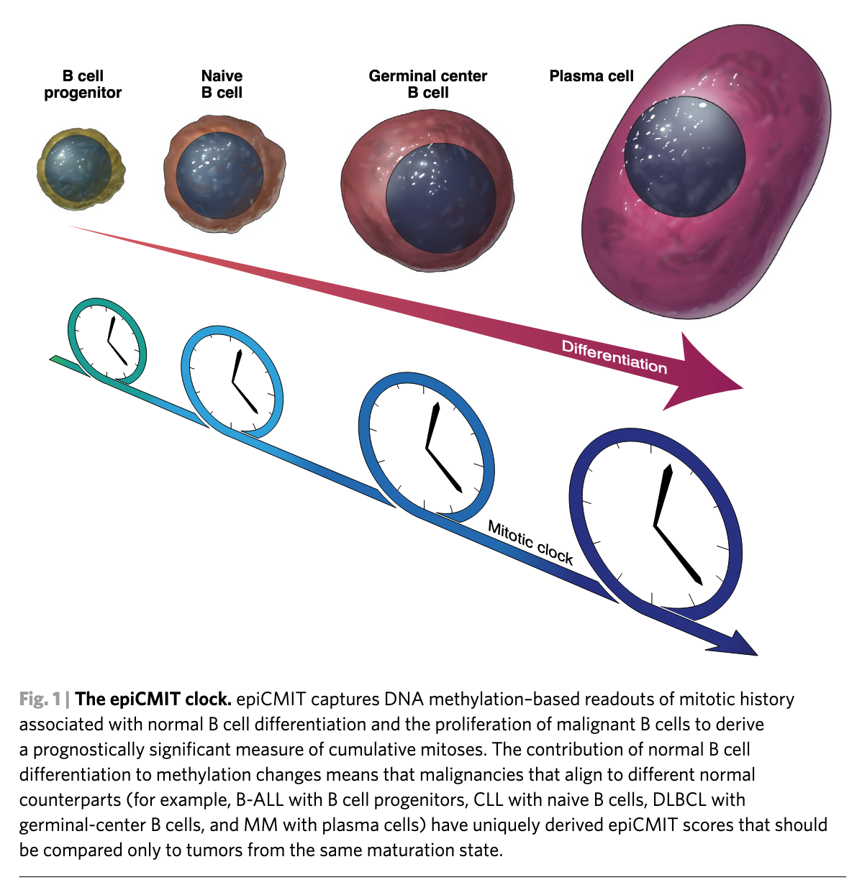
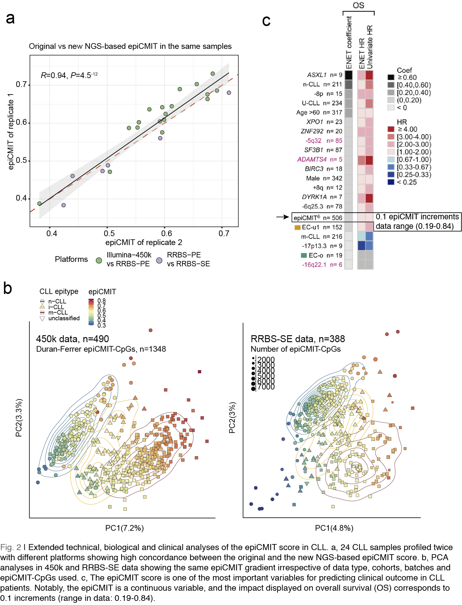

```{r setup, include=FALSE}
knitr::opts_chunk$set(echo = TRUE)
```

# Introduction

The epiCMIT (epigenetically-determined Cumulative MIToses) mitotic clock represents a relative measure of the total proliferative history of normal and neoplastic B cells. It is built considering the highest score from their two underlying hyper- and hypomethylation-based mitotic clocks, called epiCMIT-hyper and the epiCMIT-hypo, respectively. The code I provide here calculates the three mitotic clocks for each sample. All of them range from 0 to 1, depending on low or high relative proliferative history.  A comprehensive selection of CpGs was performed to build the epiCMIT. Nonetheless, given the careful CpG filtering it is likely that epiCMIT represent a pan-cancer mitotic clock. The current code supports several DNA methylation approaches, including [450k and EPIC Illumina arrays](https://duran-ferrerm.github.io/Pan-B-cell-methylome/Estimate.epiCMIT.html), and the next generation sequencing (NGS) approaches single (S) and paired end (PE) RRBS, ERRBS and WGBS, which are subsequently explained in the following section.


The epiCMIT mitotic clock, from Strati, P., Green, M.R. A, Nat Cancer, 2020.

Here, I provide the necessary steps to calculate the epiCMIT in NGS DNA methylation data. Like in the [original strategy](https://duran-ferrerm.github.io/Pan-B-cell-methylome/Estimate.epiCMIT.html), the epiCMIT is built considering the highest score from their two underlying hyper- and hypomethylation-based mitotic clocks, called epiCMIT-hyper and the epiCMIT-hypo, respectively. Please, note that the epiCMIT should always be analyzed together with the CLL epitypes (or at least with IGHV status), as the total proliferative history is dependent on the CLL cellular origin, with n-CLL/unmutated CLL showing lower baseline epiCMIT compared to m-CLL/mutated CLLs.

The validity of the NGS-based epiCMIT mitotic score has been validated in the CLL 1100 study (*Knisbacher, Lin, Hahn, Nadeu, Duran-Ferrer et al, Nat. Genet 2022,accepted*) and can be summarized in the following figure. Briefly, the new NGS-based epiCMIT estimation is strongly correlated (*R*=0.94, *P*=4.5e-12) with the original methodology in [Duran-Ferrer 2020](https://www.nature.com/articles/s43018-020-00131-2) (panel a). This new NGS-based epiCMIT was compared in paired samples profiled with different platforms , including 450k Illumina array data, RRBS-SE and RRBS-PE data. Next, unsupervised principal component analysis (PCA) shows similar epiCMIT gradients irrespective of the number and identity of the epiCMIT-CpGs used, cohort compositions and batches, further supporting its robustness (panel b). Finally and most importantly, the epiCMIT is the one of the most important -and the only- continuous variable predicting clinical outcome in CLL in a multi-omic clincal data modelling (panel c). As the range in epiCMIT is 0.19-0.84, this implies that a n-CLL patient with an epiCMIT=0.84 shows 6.2 times higher risk of dying compared to a n-CLL patient with 0.19 [ (0.84/0.19)*1.4 . The hazard ratio for each 0.1 epiCMIT increments is 1.4 in the multi-omic clinical data modelling reported in the CLL1100 study].



# Load required data.

## Load R packages.
```{r}

## Load packages and set general options
options(stringsAsFactors = F,error=NULL)
##needed packages
library(GenomicRanges)
library(data.table)

```

## Download and load required data into R.

```{r}

download.file("https://github.com/Duran-FerrerM/Pan-B-cell-methylome/raw/master/data/Estimate.epiCMIT.RData", destfile = "Estimate.epiCMIT.RData", method="libcurl")
load("Estimate.epiCMIT.RData")


```

# Analyses

The methodology to estimate the epiCMIT is the following:

1. Map your DNA methylation matrix to epiCMIT-CpGs and the correct genome assembly using the function `DNAm.to.epiCMIT`. This function converts a DNA methylation matrix (DNAm) into a suitable GRange object to calculate the epiCMIT and contains the following arguments:
    + `DNAm`: DNA methylation matrix. Should be a matrix, data.frame or GRanges object.
    + `DNAm.genome.assembly`: The genome assembly of the DNAm matrix. Supported versions are "hg19" and "hg38".
    + `map.DNAm.to`: Map the data to Illumina-450k epiCMIT-CpGs or WGBS epiCMIT-CpGs. Should be "Illumina.450K.epiCMIT" or "WGBS.epiCMIT".
    +`min.epiCMIT.CpGs`: Integer, default 800 CpGs. Recommended a minimum of 800 epiCMIT-CpGs, less CpGs have not been thoroughly tested.
    + `CpGs.as.DNAm.rownames`: logical, default TRUE. Are rownames of your matrix CpG names? If so they will be used for mapping. If FALSE, coordinates should be provided. If `DNAm` is of class matrix and `CpGs.as.DNAm.rownames=FALSE`, CpG coordinates and DNAm info columns from DNAm should be provided in the following arguments:`DNAm.chr`, `DNAm.start`, `DNAm.end`, `DNAm.meth`
  
2. Calculate the epiCMIT  after running `DNAm.to.epiCMIT` with the `epiCMIT`function, which contains the following arguments:
    +  `DNAm.epiCMIT`:The GRange object after running `DNAm.to.epiCMIT` function.
    + `return.epiCMIT.annot`: logical indicating whether to export the epiCMIT-CpGs used and metadata info.
    + `export.results`: logical, indicating whether to export the results.
    + `export.results.dir`: character indicating the path to export the results.
    + `export.results.name`: character string with the name for the exported file.


## `DNAm.to.epiCMIT` and `epiCMIT` functions.
We can create a loop with the R function `lapply` and run both functions at the same time for all the samples to subsequently store all the results into a list. To do so, we can execute the following lines of code:

```{r}

##
## Example with RRBS-SE hg19 data
##

epiCMIT.RRBS <- suppressWarnings( ## supress warning so that all warning do not appear in the html document.
  suppressMessages(
    lapply(names(RRBS.SE.hg19.Examples),function(sample.i){
  
  ##transform data to run epiCMIT() function.
  DNAm.epiCMIT <- DNAm.to.epiCMIT(DNAm = RRBS.SE.hg19.Examples[[sample.i]],
                                  DNAm.genome.assembly = "hg19",
                                  map.DNAm.to = "WGBS.epiCMIT",
                                  min.epiCMIT.CpGs = 800 # minimum recommended
  )
  
  ##calculate epiCMIT
  epiCMIT.results <- epiCMIT(DNAm.epiCMIT = DNAm.epiCMIT,
                             return.epiCMIT.annot = TRUE,
                             export.results = FALSE, ## change to TRUE to export results for every single sample
                             export.results.dir = ".",
                             export.results.name = paste0("RRBS-SE.",sample.i,"_example_")
  )
})
)
)


```

We now can gather all the relevant results into a matrix-like structure so that we can export all the table at once.

```{r}

## prepare data to export it.
epiCMIT.RRBS.scores <- do.call(rbind,lapply(epiCMIT.RRBS,function(x){x[["epiCMIT.scores"]]}))
epiCMIT.RRBS.scores$epiCMIT.CpGs <- as.numeric(do.call(rbind,lapply(epiCMIT.RRBS,function(x){x[["epiCMIT.run.info"]][["epiCMIT.CpGs"]]})))
epiCMIT.RRBS.scores$epiCMIT.hyper.CpGs <- as.numeric(do.call(rbind,lapply(epiCMIT.RRBS,function(x){x[["epiCMIT.run.info"]][["epiCMIT.hyper.CpGs"]]})))
epiCMIT.RRBS.scores$epiCMIT.hypo.CpGs <- as.numeric(do.call(rbind,lapply(epiCMIT.RRBS,function(x){x[["epiCMIT.run.info"]][["epiCMIT.hypo.CpGs"]]})))
head(epiCMIT.RRBS.scores[,-1])

##export
fwrite(epiCMIT.RRBS.scores,"epiCMIT.RRBS.scores.tsv",sep="\t")

```

## Get all code at once
```{r ref.label=knitr::all_labels(), echo=TRUE, eval=FALSE}
```


# Session Information

```{r}

sessionInfo()

```


